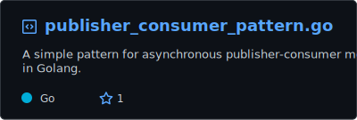

Hi,
I am a DevOps Engineer who swims with Kubernetes and rows with cool DevOps stuffs!

> Experienced in crafting scalable, resilient backend systems and workflows using Golang. Proficient in building custom controllers, operators, and CRDs for Database management on Kubernetes. Passionate about CI/CD, automation, and performance optimization. Got problem-solving skills and a competitive programming background.

Major Production Grade Projects where I have significant contributions:
- KubeDB [Managed Database solution for Kubernetes]
- Internal Developer Platform(IDP)

### Stats

    

### Gists

<h3 align="left">Find Me On:</h3> 

    <a href="https://raihankhan.github.io/">
        
     
    
    
    

<h3 align="left">Connect with me:</h3> 

    
    

📫 - shoot an email at <b>raihankhanraka@gmail.com</b>

 
  
